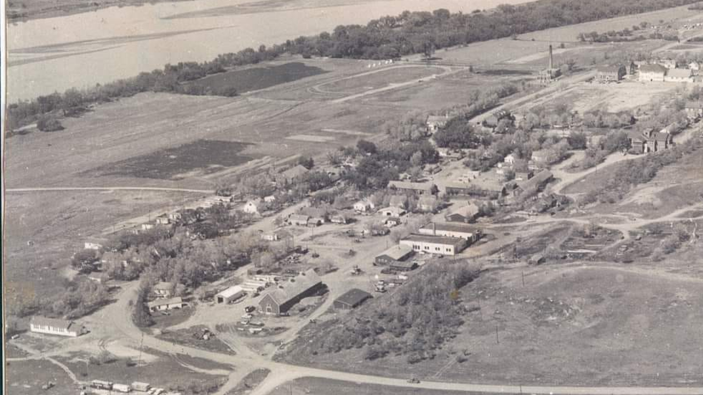

# SubmergedHistory
Submerged History: Remembering the Old Cheyenne Agency

## Project description: 
The Old Cheyenne Agency was a significant cultural and administrative center for the Cheyenne River Sioux Tribe, 
but it was flooded and its precise location under the Missouri River is now uncertain. Its loss reflects a broader 
erasure of Indigenous heritage due to large-scale infrastructure projects. There is currently limited public knowledge 
or access to its physical history. Understanding and acknowledging submerged Indigenous sites is crucial for historical accuracy, 
cultural preservation, and reconciliation.

### Data description
The datasets are from the USGS site. 
Working with LiDAR data and Historical maps. 

**LiDAR data (.laz)** 
Description: High-resolution elevation raster for the region flooded for the Missouri River.
**Historical Maps** 
Description: Historical maps from USGS and archives of the Cheyenne River Sioux Tribe

### Project Goals
Visualize the submerged terrain of the Cheyenne Agency 
Identify structures using different techniques
Overlay historical maps to align with LiDAR-derived DEM 
Preserve Indigenous memory through digital mapping and analysis

### Instructions for the Workflow
> Workflow notebook in the Notebooks folder

##### Citations
USGS LiDAR Data (https://apps.nationalmap.gov/lidar-explorer/#/)
Historical Maps from the Cheyenne River Sioux Tribe
